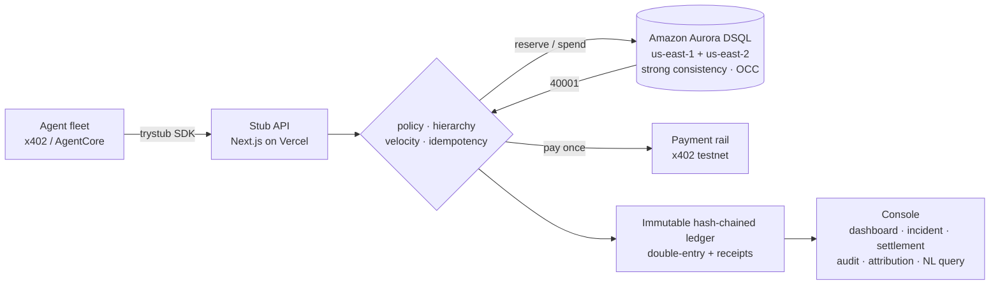

# Stub

**The general ledger for agent spend.**

_One budget your agents can't break._

> Stub is the general ledger for agent spend: the one budget your fleet can't overspend, because
> the database, not your code, rejects the transaction that would.

**Live:** [trystub.vercel.app](https://trystub.vercel.app) · built on Amazon Aurora DSQL + Next.js on Vercel

---

## What is Stub?

Stub is a strongly-consistent, double-entry **spend ledger** for an organization's fleet of
autonomous AI agents and the money they spend: x402 micropayments, paid APIs, and LLM tokens. It
enforces one company-wide budget that **cannot be overspent** and produces an immutable, queryable
audit trail. The gate that refuses an overspend is one feature of the ledger, not the product.

Think **Ramp / Brex for the agent economy**. As agents move from reading to _spending_ real money,
every company running them needs org-wide budget enforcement and audit-grade books.

## The problem

Agent payment frameworks (e.g. AWS Bedrock AgentCore Payments) give agents wallets, but spending
limits are enforced **per session only**. There is no org-wide, cross-agent, cross-region budget
governance and no audit-grade ledger. A fleet can quietly overspend overnight (every session
within its own limit) and afterward no one can answer the CFO's two questions: **how much did our
agents spend, and on exactly what?**

This is not hypothetical. A single agent stuck in a loop has run up four- and five-figure bills
overnight; one documented storm reached hundreds of thousands of API calls before an account was
suspended. Monitoring and alerts report the overspend _after_ it happens; they can't refuse it.
Stub refuses it before the transaction commits, and keeps books finance can reconcile.

That gap is Stub.

## How it works

A spend that would breach a budget cap **fails the database transaction**. Under concurrent
cross-region writes, Aurora DSQL's optimistic concurrency control returns a serialization failure
(`SQLSTATE 40001`); Stub retries against the fresh balance and either commits or records a denial.
The result is a **zero overspend window**, guaranteed by the database rather than by application
locking or luck.

The contended row is the lock: a spend debits its account and rolls every ancestor balance up the
hierarchy in the same transaction, so concurrent agents racing the same budget serialize on a
shared row and the loser conflicts. This is why the invariant holds across regions where row locks
(`SELECT … FOR UPDATE`) don't exist.

### The non-obvious part: exactly-once around an irreversible payment

A naive retry around OCC has a sharp edge. If the payment is sent _inside_ the retried transaction,
a serialization conflict re-runs the block and **pays again**: real money, gone twice. Stub splits
the flow the way card networks do: **reserve → pay → settle**. The estimate is held against the cap
in one transaction; the irreversible payment fires exactly once, guarded by an idempotency key,
_outside_ the transaction; then a second transaction settles the actual cost and refunds the
difference. OCC retries only ever replay the ledger, never the payment. A crash between pay and
settle is reclaimed by an idempotent sweeper: settle and sweep contend on the hold row, OCC picks
one winner, the other is a no-op.

```
Agent (x402 / AgentCore)
  → 3-line SDK ─ guard() · reserve → pay → settle
  → Stub API (Next.js route: auth · rate-limit · request id)
      → policy + hierarchy + velocity check
      → atomic double-entry write under Aurora DSQL OCC ──(40001)──► retry / deny + denial entry
  → immutable, hash-chained ledger
      → mission-control dashboard (live) · incident replay · audit · attribution · NL query
```

## Proven, not asserted

The invariants are demonstrated, not just claimed:

- **`npm run harness`** races a naive retry against Stub under concurrent writers with crashes
  injected after payment. The naive baseline double-pays: it sends ~$43 of payments against a $3
  budget; Stub sends exactly what committed, leaves no stuck holds, and never goes negative. The
  same assertions run in CI (`npm test`).
- **`npm run test:live`** runs the real cross-region race: six agents in two AWS regions hit one
  near-empty budget on the live cluster; exactly what fits commits, the rest deny with real
  `40001`s, the balance never goes negative.
- **The audit page** re-verifies the hash chain and demonstrates tamper detection on a throwaway
  copy of a real entry; the live ledger is never touched.

## Why Aurora DSQL

Budget-enforcement correctness _is_ the database's consistency model. The load-bearing property is
**active-active, multi-region strong consistency**: a writer in `us-east-1` and a writer in
`us-east-2` hitting the same balance resolve to one consistent outcome. No other AWS database
offers it: Aurora PostgreSQL Global is single-writer, and DynamoDB global tables are eventually
consistent (last-writer-wins → silent overspend during replication). Swap the database and the core
safety feature breaks.

## Architecture

| Layer    | Choice                                                                |
| -------- | --------------------------------------------------------------------- |
| Database | **Amazon Aurora DSQL**: strong consistency + OCC (load-bearing)       |
| Driver   | `pg` over the Aurora DSQL Node connector (automatic IAM tokens)       |
| API      | Next.js App Router route handlers (Node runtime)                      |
| Frontend | Next.js + Tailwind                                                    |
| Deploy   | Vercel                                                                |
| NL query | OpenAI function-calling, with a deterministic offline parser fallback |
| SDK      | `trystub` on npm: dependency-free `fetch` client                      |



The codebase keeps the domain pure and the database swappable:

```
core/   pure, dependency-free domain: ledger, settlement, harness, policy, hash chain, query
db/     the Aurora DSQL adapter: connection pool, Store implementation, schema.sql
sdk/    the drop-in client (published to npm as trystub) + x402 / AgentCore adapter
app/    Next.js console: dashboard · incident · settlement · audit · attribution + API routes
config/ single source of truth for env      scripts/  migrate · seed · harness · demo-agent
test/   invariant suite (overspend, exactly-once, hash chain) + live cross-region proof
```

## Data model

A deliberate double-entry ledger:

- **`accounts`**: budget accounts (org → team → agent → vendor), each with a balance, a hard cap,
  and an optional velocity limit. A spend is bound by the **tightest cap up the hierarchy**: it
  debits the named account and rolls up every ancestor's balance in the same transaction.
- **`entries`**: immutable double-entry lines; the append-only audit log. Each carries a compressed
  JSON receipt of the full payment context and is **hash-chained** (`prev_hash → hash`) so any
  altered or removed row is detectable. Every line is attributed to a user, intent, agent, session,
  and **cost center** (the chargeback dimension: team, customer, or feature).
- **`reservations`**: the reserve→settle state machine (`held → settled | released`). A hold binds
  funds against the cap; settle books the actual cost and refunds the rest. Settling is exactly-once.
- **`policies`**: layered ceilings (per-transaction · rolling window · cumulative), evaluated against
  each spend at runtime, plus vendor allow/blocklists and approval thresholds.
- **`agents` / `sessions`**: identity, session budgets, and scoped API keys (SHA-256 hashed).

## Features

- **Overspend invariant**: concurrent cross-region writes that would breach a cap fail with
  `SQLSTATE 40001` and are recorded as denials; the balance never goes negative.
- **Exactly-once settlement**: reserve → pay → settle so a retry around an irreversible payment
  can't double-charge; a crashed hold is reclaimed by an idempotent sweeper.
- **Hierarchical budgets**: org → team → agent caps enforced together in one transaction.
- **Policy engine**: per-transaction caps, rolling-window ceilings, vendor allow/blocklists, and
  human-in-the-loop approval thresholds, evaluated inside the spend transaction.
- **Policy simulator**: replay the immutable history against a candidate rule ("this would have
  blocked 7 spends and saved $340") before enabling it.
- **Velocity circuit-breaker**: runaway spend trips a per-account velocity limit and auto-freezes
  the account.
- **Kill-switch**: freeze a single agent or the entire fleet instantly.
- **Tamper-evident audit trail**: hash-chained entries verified on demand, with a live
  tamper-detection demo and an accounting **journal export** (CSV for QuickBooks / NetSuite).
- **Cost attribution (chargeback / showback)**: every spend tags a team, customer, or feature;
  roll spend up by any of them to answer who drove it.
- **Incident replay**: unleash a documented runaway-agent pattern at a budget on the live cluster
  and watch the cap hold, transaction by transaction.
- **Agent registry + scoped API keys**: issue a key bound to one budget account; spends made with
  it are pinned to that agent and attributed.
- **Burn alerts + forecasting**: 50 / 80 / 100% thresholds and projected runway until a cap is hit.
- **3-line SDK**: drop the budget gate in front of any paid call; money moves only after the spend
  commits.
- **Mission-control dashboard**: org guardrail, accounts with burn bars, the agent registry, and
  live ledger + denial feeds.
- **Natural-language query**: ask about spend in plain English; the model fills a constrained,
  parameterized query over the ledger, never raw SQL.

## Quickstart

```bash
npm install
cp .env.example .env        # set DSQL_* (and optionally OPENAI_API_KEY)
npm run check:db            # verify the Aurora DSQL connection
npm run migrate && npm run seed
npm run dev                 # dashboard at http://localhost:3000
npm run demo:agent          # an agent spending through the gate (needs the dev server running)
```

Tests & proofs:

```bash
npm test                    # offline invariant suite (in-memory OCC model, no cluster needed)
npm run harness             # naive-vs-Stub exactly-once comparison (double-pay made visible)
npm run test:live           # live cross-region overspend proof (requires DSQL_ENDPOINT_PEER)
```

## SDK

Published to npm as [`trystub`](https://www.npmjs.com/package/trystub): dependency-free,
works anywhere `fetch` exists.

```bash
npm install trystub
```

```ts
import { StubClient } from "trystub";

const stub = new StubClient({ apiKey: process.env.STUB_API_KEY });

if (await stub.guard({ vendorAccountId, amountUsd: 0.02, intent: "fetch market data" })) {
  await doThePaidThing();
}
```

When the payment is irreversible, reserve first, pay once, then settle the real cost:

```ts
import { StubClient } from "trystub";
import { payThroughStub } from "trystub/x402";

const data = await payThroughStub(stub, vendorAccountId, {
  status: 402,
  priceUsd: 0.04,
  intent: "fetch market data",
  costCenter: "Marketing",
  pay: async () => {
    const res = await fetchPaidResource();
    return { result: res.body, actualUsd: res.chargedUsd };
  },
});
```

## Deployment

Runs as a standard Next.js app on Vercel. The API routes connect to Aurora DSQL via the AWS
credential chain, so the deployment needs `DSQL_ENDPOINT`, `DSQL_REGION`, `AWS_ACCESS_KEY_ID`,
`AWS_SECRET_ACCESS_KEY`, and `OPENAI_API_KEY` set as environment variables (with `DSQL_POOL_MAX=1`
for serverless). The cluster is multi-region (`us-east-1` + `us-east-2` with a `us-west-2`
witness), which is what makes the cross-region overspend proof real rather than simulated.

The SDK publishes itself: push a `sdk-v*` tag (with an `NPM_TOKEN` repo secret set) and the
`Publish SDK` workflow builds and ships `trystub` to npm. To publish manually:
`cd sdk && npm publish --access public`.

## Development

```bash
npm run lint            # ESLint (eslint-config-next)
npm run format          # Prettier write
npm run typecheck       # strict TypeScript
npm run verify          # lint + typecheck + offline invariant suite
```

Code is formatted with Prettier and linted with ESLint, and the repo installs
[Husky](https://typicode.github.io/husky) git hooks on `npm install`: a **pre-commit** hook runs
lint-staged (ESLint `--fix` + Prettier on staged files) and a **commit-msg** hook enforces
[Conventional Commits](https://www.conventionalcommits.org). See
[CONTRIBUTING.md](./CONTRIBUTING.md) for the full standards.

## License

MIT © Ashutosh Jha. See [LICENSE](./LICENSE).
